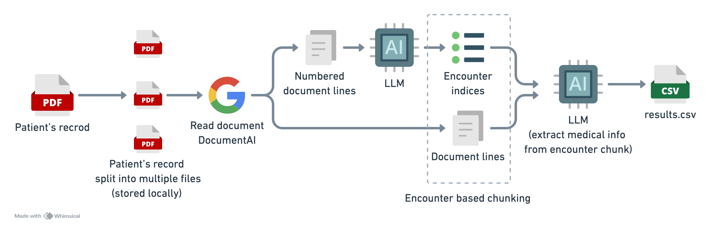

# Anterior Take Home Test

## Quick start
The quickest way to get started is by creating a conda environment and installing the necessary packages. 
The code was tested using with python 3.11 and OpenAI GPT-4. 

```bash
conda create -n "anterior-env" python=3.11
conda activate anterior-env
pip install -r requirements.txt
```

You can then run the pipeline as follows
```bash
python submission.py --path=data/inpatient_record.pdf
```

Results can be found in `data/output/results.csv`.

## Overview

We are given a medical record `data/inpatient_record.pdf` for a patient, and we need to extract any useful information 
together with associated time. Typical RAG based approaches however will unlikely to perform well here due to the 
unstructured nature of the data source. 

Here we use the idea of encounter based chunking where the document text is chunked based on lines identified by 
LLM as indicating an encounter. Various extractors can then be applied to the chunks to extract useful information.

Results show this approach is able to extract useful information with associated time.



The pipeline steps are as follows:
1. The patient document record `inpatient_record.pdf` is split into multiple smaller documents. This is because DocumentAI can take a maximum of 15 pages.
2. Documents are processed by DocumentAI and document text is combined.
3. Text lines are numbered and some lines are filtered. LLM is used to extract the indices of lines indicating an encounter.
4. Encounter based chunking is performed to chunk roughly based on the start and end of an encounter.
5. Extractors are used to extract useful information from the encounter based chunks.

## Technical details
To overcome the 15 pages limitation of DocumentAI, the main PDF document was divided into multiple smaller documents.
The resultant documents were then processed by DocumentAI and document text is combined. The decision to create a copy
of the document text with numbered lines proved useful as it allowed filtering and preprocessing without impacting the order.

The initial attempt of extracting medical encounters from the document text resulted in many 'false encounters', these 
are simply lines of text without useful content like 'TO:' or 'SECTION'. To mitigate this, we applied two filters:
1. Filter very short lines (< 6 characters)
2. Filter text without digits.

We used the following extractors to extract useful medical information from the encounter based chunks:
- An extractor to extract a timestamp from an encounter chunk.
- An extractor to extract medical findings from an encounter chunk.

Note that extractors can anything like a keyword extractor, entity extractor and not just LLM.

For the timestamp extractor, some dates were extracted incorrectly due US date format “mm-dd-yyyy”. This issue was fixed by providing some examples in the prompt. 
For the medical findings extractor, we found that the use of CoT is helpful when extracting medical findings.

## Conclusions
Overall the pipeline seems to be effective in extracting useful information from the patient's with potential for further improvements.
Improvements can be achieved through removal of duplicate records, incorporating common information such as DOB and document print date as metadata to be used for filtering.
One can also consider the use of specialists LLM fine-tuned on medical records to improve the data extraction.
